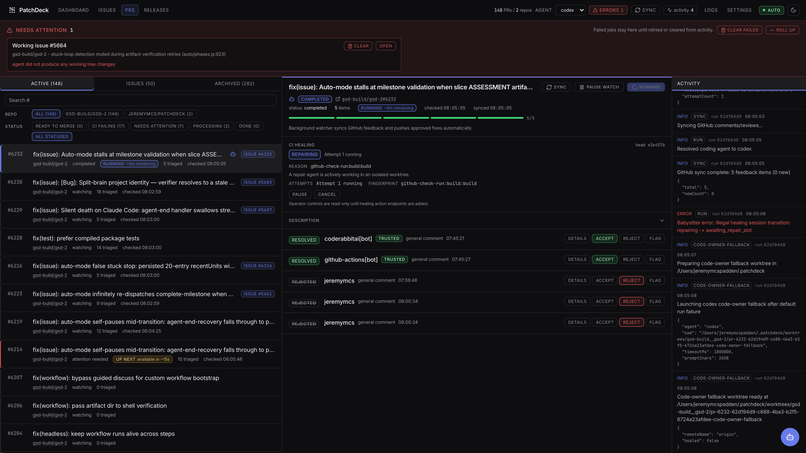
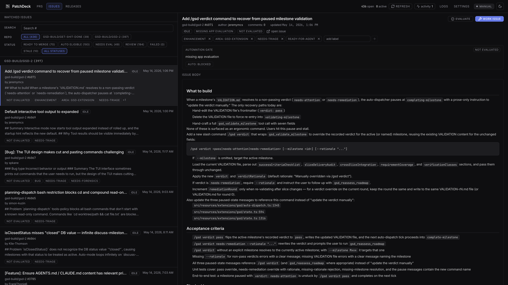

# PatchDeck

[](https://github.com/jeremymcs/patchdeck/actions/workflows/ci.yml)
[](LICENSE)
[](https://nodejs.org/)
[](https://www.typescriptlang.org/)

PatchDeck is a local-first workbench for keeping GitHub pull requests and issues moving. It watches the repositories you choose, syncs review feedback and failed checks into one dashboard, then runs your local coding agent in an isolated worktree when something should be fixed.

The goal is simple: fewer stale PRs, fewer forgotten review comments, and less time bouncing between GitHub tabs just to figure out what still needs action.





PatchDeck can spend paid agent usage when automation is enabled. Start manually, watch the logs, and only turn on the automatic paths you actually trust.

## What It Does

PatchDeck gives you one place to manage the repetitive work around PRs and issues:

- Watch GitHub repositories or individual PR URLs.
- Sync review comments, review threads, PR status, mergeability, CI state, and activity logs.
- Triage feedback into accepted work, rejected/no-op feedback, or items that need human review.
- Run accepted work in isolated git worktrees under the PatchDeck home directory.
- Commit and push verified fixes back to the PR branch.
- Reply to GitHub review threads and resolve conversations when work is complete.
- Monitor GitHub issues and open fix PRs for issues that are marked ready.
- Queue release runs for merged PRs and publish GitHub releases when enabled.
- Track CI healing sessions and bounded retry attempts for repairable failures.
- Monitor supported post-merge deployments and open follow-up fix PRs when enabled.
- Ask natural-language questions about tracked PR state through the dashboard, API, or MCP.

It is intentionally local-first. State lives on the machine running PatchDeck, Git work happens in app-owned worktrees, and remote dashboard access is opt-in.

## Install

Prerequisites:

- Node.js 22+
- Git
- GitHub auth through one of: saved dashboard token, `GITHUB_TOKEN`, or `gh auth login`
- A supported local coding CLI installed and authenticated: `claude` or `codex`

Install from npm:

```bash
npm install -g @jeremymcs/patchdeck
patchdeck
```

The npm package is scoped as `@jeremymcs/patchdeck`; the installed command is `patchdeck`.

By default, the dashboard starts on `http://localhost:5001` and opens in your browser.

## First Run

1. Open the dashboard.
2. Add a repository to watch, or paste a single PR URL.
3. Confirm GitHub auth in Settings if the app cannot read a token automatically.
4. Keep repo discovery on **My PRs only** until you want team-wide monitoring.
5. For a cautious first run, turn off **Auto PRs** and **Auto Issues** before adding busy repositories.
6. Use manual PR and issue actions until the behavior looks right for your repos, then re-enable the automatic paths you want.

Direct PR URLs stay tracked even if a repository is still set to **My PRs only**.

## Pull Requests

PatchDeck monitors open PRs from watched repositories and PRs added directly by URL. It stores the PR metadata, comments, review threads, failing checks, mergeability, docs-assessment state, release-readiness state, and local activity logs.

Each feedback item moves through a visible lifecycle:

```text
pending -> queued -> in_progress -> resolved
       \-> rejected
       \-> flagged
       \-> failed / warning
```

When work is accepted, PatchDeck prepares a clean worktree, runs the configured local coding agent with the relevant PR context, records the run, and handles the follow-up. Depending on the situation, that can include pushing commits, posting GitHub replies, resolving review threads, and polling CI.

You can pause background automation for a single PR without removing it. Paused PRs remain visible and can still be worked manually.

## Issues

PatchDeck can watch open issues for each repository. The Issues page shows the issue body, labels, author, comments, work state, failed attempts, linked PRs, and auto-work eligibility.

Manual issue work starts with **Work issue**. PatchDeck creates an isolated worktree, works from the issue context, pushes a branch, opens a linked PR, and records the result.

Automatic issue work is opt-in per repository. It is gated by labels and safety checks:

- Ready labels include `ready-for-agent`, `ready-to-work`, `agent-ready`, and `ready`.
- Blocking labels include `blocked`, `question`, `needs-maintainer-review`, `needs-author-feedback`, and `needs-discussion`.

Priority issue authors can be configured so issues from specific GitHub users are evaluated and worked before the regular queue.

## Releases

PatchDeck can evaluate merged PRs for release-worthiness, propose a version bump, write release notes, and create a GitHub release.

Release creation is off by default. You can keep automatic releases disabled and still use the manual **Release** button on a watched repository. The Releases page shows both PatchDeck release runs and GitHub releases, including releases created outside the app.

The Releases page also includes social-post generation for release runs when you want a short shareable summary.

## CI and Deployment Healing

Automatic CI healing is off by default. When enabled, PatchDeck classifies failing checks, creates healing sessions, and only attempts bounded repairs for failures it considers repairable in the PR branch. Retry limits and concurrency are configurable.

Deployment healing is also off by default. When enabled through config, PatchDeck can monitor merged PRs for supported deployment platforms and open a follow-up fix PR if the deployment fails. Current platform detection supports Vercel and Railway markers, and the matching platform CLI must be installed and authenticated on the same machine.

## Interfaces

| Interface | Command | Use it for |
| --- | --- | --- |
| Web dashboard | `patchdeck` or `patchdeck web` | Primary UI for PRs, issues, releases, logs, and settings |
| MCP server | `patchdeck mcp` | Tool access from an MCP-compatible host |
| Local REST API | Started with the dashboard server | Programmatic access to the same local app state |
| Desktop app | `npm run tauri:build` from source | Native shell with the same dashboard and a menu-bar tray |

The desktop build keeps PatchDeck running from the macOS menu bar, shows live PR and issue counts, and exposes quick toggles for automatic PR and issue work.

## Commands

```bash
patchdeck              # start the dashboard server
patchdeck web          # start the dashboard server
patchdeck mcp          # start the MCP server
patchdeck --help       # show help
patchdeck --version    # print version
```

Logging flags work before or after the subcommand:

```bash
patchdeck -q
patchdeck --verbose
patchdeck --debug
patchdeck --trace
patchdeck --log-level warn
patchdeck --log-file ./patchdeck.log
patchdeck --no-log-file
```

Set `PORT` to change the dashboard server port. The default is `5001`.

If the MCP server needs to talk to a dashboard server on a non-default port, set `PATCHDECK_PORT`.

## Configuration

PatchDeck stores local state in:

```text
~/.patchdeck/state.sqlite
```

Set `PATCHDECK_HOME` to use a different directory.

Most configuration is editable in Settings:

- GitHub tokens
- Web dashboard credentials for remote access
- Coding agent and optional fallback behavior
- Model/runtime settings exposed by the app
- Trusted reviewers
- Ignored bots
- Priority issue authors
- Watched repositories and per-repo watch scope
- Auto PRs and auto issues
- Drain mode
- Merge-conflict handling
- Release automation
- Docs assessment
- GitHub comment branding
- GitHub progress replies
- CI healing
- Theme

Key defaults:

- New watched repos start as **My PRs only**.
- Auto PRs and auto issues are enabled globally, but per-repo issue work still needs the repo-level settings and labels.
- Automatic release creation is disabled.
- Automatic CI healing is disabled.
- Automatic deployment healing is disabled.
- Drain mode pauses new agent work without deleting tracked state.

## Authentication

PatchDeck uses the first available GitHub credential in this order:

1. Tokens saved in the dashboard.
2. `GITHUB_TOKEN`.
3. `gh auth token`.

Saved dashboard tokens can be added, removed, and reordered in Settings.

## Remote Dashboard Access

Local browser and local API access do not require a web login. To open the dashboard from another computer on the network, configure credentials before starting PatchDeck:

```bash
PATCHDECK_WEB_USERNAME=operator \
PATCHDECK_WEB_PASSWORD='choose-a-long-password' \
PATCHDECK_SESSION_SECRET='choose-a-long-random-secret' \
patchdeck
```

`PATCHDECK_SESSION_SECRET` is optional, but setting one keeps remote dashboard sessions stable across restarts.

You can also save remote-access credentials from Settings.

PatchDeck binds the dashboard server to the configured port on all interfaces. Remote browsers must sign in before API data loads. Use TLS before exposing the dashboard outside a trusted network.

## Logging

PatchDeck writes structured server logs to stdout and, by default, to:

```text
~/.patchdeck/log/server.log
```

Use `--log-file`, `PATCHDECK_LOG_FILE`, `--no-log-file`, or `PATCHDECK_NO_LOG_FILE=1` to change file logging. Use `--log-level` or `LOG_LEVEL` to change verbosity.

The dashboard also includes a Logs page with filtering, search, and live tailing for recent server log records.

GitHub tokens are redacted from logs before they are written.

## Run From Source

```bash
git clone https://github.com/jeremymcs/patchdeck.git
cd patchdeck
npm install
npm run dev
```

Common development commands:

| Command | Purpose |
| --- | --- |
| `npm run dev` | Start the development server |
| `npm run build` | Build the production bundle |
| `npm run start` | Run the production build |
| `npm run mcp` | Start the MCP server from source |
| `npm run check` | Run TypeScript checks |
| `npm run lint` | Run ESLint |
| `npm run test` | Run server tests |
| `npm run test:all` | Run server tests and client utility tests |
| `npm run tauri:dev` | Start the desktop app in development |
| `npm run tauri:build` | Build the desktop app |

## Docs

- [Getting Started](docs/public/getting-started.md)
- [PR Babysitter](docs/public/pr-babysitter.md)
- [Agent Dispatch](docs/public/agent-dispatch.md)
- [PR Q&A](docs/public/pr-questions.md)
- [Configuration](docs/public/configuration.md)
- [Local API and MCP](LOCAL_API.md)
- [Contributing](CONTRIBUTING.md)

## Credits

PatchDeck began as a fork of [yungookim/oh-my-pr](https://github.com/yungookim/oh-my-pr) by KimY. The foundation is appreciated.

## License

[MIT](LICENSE) © 2026 KimY
